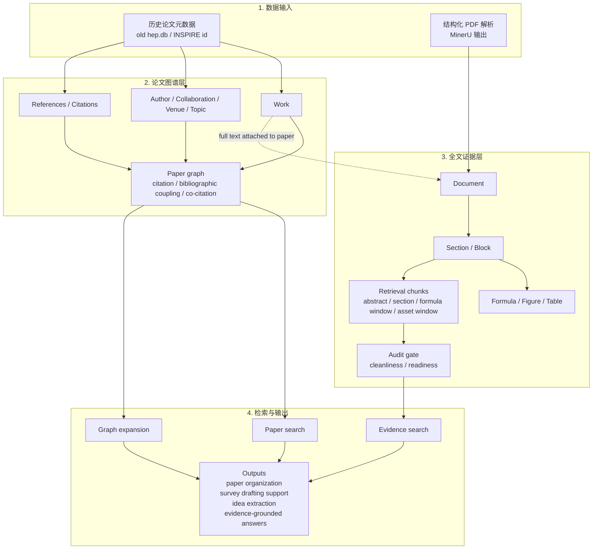

# HEP-RAG v2 总览图

适用对象：完全不懂技术的人

这页适合做 30 到 90 秒的总览讲解。

## 60 秒讲法

- 这套系统不是一层，而是两层。
- 上层是论文图谱，负责回答“这篇论文和谁相关、属于哪个方向、被谁引用”。
- 下层是全文证据层，负责回答“具体证据在哪一段、哪个公式、哪张图里”。
- 一次查询不应该直接在 PDF 里乱搜，而应该先找到正确的论文邻域，再下钻到证据。
- LLM 可以以后接在最上层做总结，但底层导入、切块、建图不依赖 LLM。

## 当前真实数据状态

截至 2026-03-22，本地 pilot corpus 已经达到：

- 101 篇 works
- 100 篇结构化全文
- 3703 个 chunks
- 227 个 formulas
- 768 个 assets
- 3862 条 citation
- 70 条 resolved in-corpus citations
- 128 条 bibliographic-coupling 边
- 21 条 co-citation 边
- 87 / 100 篇全文达到 `ready_for_next_phase`

## 如果别人问“为什么不直接搜 PDF？”

- PDF 关键词搜索太浅。
- 纯向量检索太黑箱，不方便审计。
- 论文图谱可以先缩小范围，再读全文。
- 结构化证据把公式、图表、段落和上下文绑在一起。
- 这更适合做综述写作、相关工作整理和 idea 发现。
