# HEP-RAG v2

## 面向高能物理论文的“图谱 + 证据”框架

- 目标：把海量论文变成可组织、可检索、可总结的知识系统
- 面向任务：综述写作、相关工作整理、idea 提炼、证据定位
- 核心原则：**导入和建图尽量不用 LLM**

> 不是“聊天机器人先看 PDF”，而是“先搭知识底座，再做上层能力”。

---

# 为什么要做这件事

- 论文数量太大，人工维护文献地图成本很高
- 只靠 PDF 关键词搜索，结果太浅、太碎
- 只靠向量检索，内部过程不透明，也不方便审计
- 真正有用的系统，应该同时知道：
  这篇 paper 属于哪个主题簇、和谁相关、全文里的证据在哪里

---

# 核心思路

## 不是一层，而是两层

- **Paper graph layer**
  论文级信息：title、abstract、authors、venue、references、citation 关系
- **Full-text evidence layer**
  全文级信息：sections、blocks、chunks、formulas、figures、tables

一句话：

> 先在“论文图谱”里找到正确范围，再到“全文证据层”里找到能支持结论的内容。

---

# 系统结构

---

# 一篇查询是怎么走的

1. 输入一个主题，先在 paper graph 里找到相关 paper 和相关邻居
2. 用 citation、bibliographic coupling、co-citation 扩展候选集合
3. 再下钻到 chunk / formula / figure 这些全文证据
4. 最终输出的不是一堆 PDF，而是：
   相关 paper、关键证据、以及它们之间的结构关系

---

# 现在已经跑通到什么程度

本地真实 pilot 数据，日期：**2026-03-22**

- `101` 篇 works
- `100` 篇结构化全文
- `3703` 个 retrieval chunks
- `227` 个 formulas
- `768` 个 assets
- `3862` 条 citation 记录
- `128` 条 bibliographic-coupling 边
- `21` 条 co-citation 边
- `87 / 100` 篇全文已经达到当前 `ready_for_next_phase` 标准

这说明它已经不是概念验证，而是一个**真实可用的底座**。

---

# 一个直观例子

- 某篇 2023 年 exotic Higgs 论文
- 系统会自动连到几篇同方向的 light pseudoscalar / exotic decay 论文
- 这些连接不是手工写的
- 也不是 LLM 猜出来的
- 而是由引用关系和共享参考文献自动长出来的

结果：

> 你看到的不只是“哪篇文档命中了关键词”，而是“这个问题在文献网络里处于什么位置”。

---

# 这套框架的价值

- 对外行：它像“高能物理版的知识地图”
- 对研究者：它像“图谱导航 + 证据检索”的组合工具
- 对项目本身：它给后续综述写作、论文整理、idea 挖掘提供统一底座

关键点：

- 上层可以以后再接 LLM 做 synthesis
- 但底层 ingestion、chunking、graph building 已经能独立成立

---

# 下一步

- 把 metadata graph 从 `101` 篇扩到 `1k-5k`
- 全文仍然保持 curated subset，不急着全量 PDF 化
- 后续再补 paper-level similarity 和 survey workflow

结论：

> 现在已经足够拿这套框架去讲给完全不懂的人听，也足够继续往更大规模推进。
